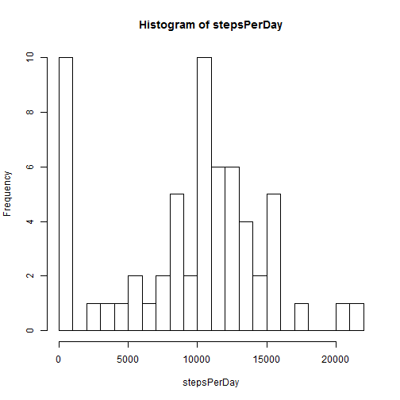
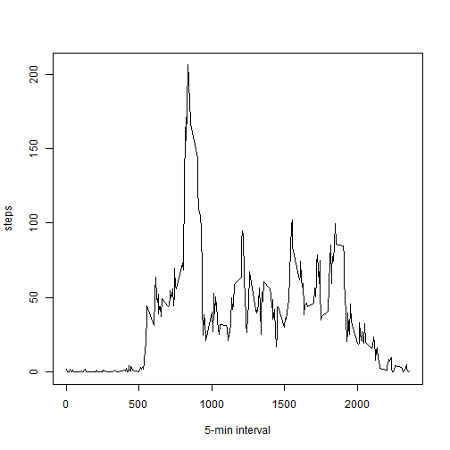
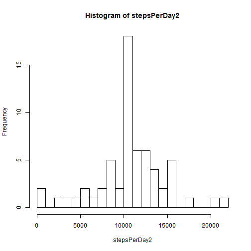
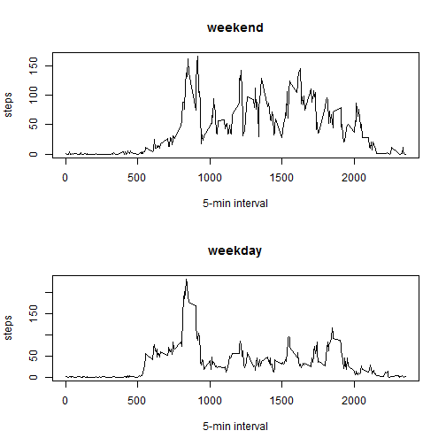

# Reproducible Research: Peer Assessment 1


## Loading and preprocessing the data

```r
data = read.csv("activity.csv")
```


## What is mean total number of steps taken per day?
### make a histogram of total number of steps taken per day

```r
# split by date
dateGroup = split(data, data$date)
stepsPerDay = sapply(dateGroup, function(ele) sum(data.frame(ele)$steps, na.rm = T))
hist(stepsPerDay, breaks = 20)
```

 

### Calculate and report the mean and median total number of steps taken per day


```r
meanSteps = mean(stepsPerDay)
medianSteps = median(stepsPerDay)
```


The mean and median total number of steps taken per day are 9354.2295 and 10395 respecitively.

## What is the average daily activity pattern?
### Make a time series plot (i.e. type = "l") of the 5-minute interval (x-axis) and the average number of steps taken, averaged across all days (y-axis)


```r
# calculate the mean steps for each interval
intervalGroup = split(data, data$interval)
stepsPerInterval = sapply(intervalGroup, function(ele) mean(data.frame(ele)$steps, 
    na.rm = T))
plot(names(stepsPerInterval), stepsPerInterval, type = "l", xlab = "5-min interval", 
    ylab = "steps")
```

 

### Which 5-minute interval, on average across all the days in the dataset, contains the maximum number of steps?


```r
index = which(stepsPerInterval == max(stepsPerInterval, na.rm = T))
intervalName = names(stepsPerInterval)[index]
```

The 835 interval has the maximum number of steps on average.
## Imputing missing values

### Calculate and report the total number of missing values in the dataset 

```r
narows = dim(data)[1] - sum(complete.cases(data))
```


2304 observations in the original data have missing values.

### Using the means of 5-minute intervals to fill in all of the missing values in the dataset.


```r
# calculate the mean steps for each interval
intervalGroup = split(data, data$interval)
stepsPerInterval = sapply(intervalGroup, function(ele) mean(data.frame(ele)$steps, 
    na.rm = T))
# use the mean steps to fill NAs
naRows = !complete.cases(data)
indexes = which(naRows)
# make a copy of the data
assign("data3", data)
for (i in 1:length(indexes)) {
    data3[indexes[i], 1] = stepsPerInterval[[as.character(data[indexes[i], 3])]]
}
```


### The above codes also create a new dataset called data3 that is equal to the original dataset but with the missing data filled in.

### Make a histogram of the total number of steps taken each day and Calculate and report the mean and median total number of steps taken per day.


```r
# split by date
dateGroup2 = split(data3, data$date)
stepsPerDay2 = sapply(dateGroup2, function(ele) sum(data.frame(ele)$steps, na.rm = T))
hist(stepsPerDay2, breaks = 20)
```

 

```r

meanSteps2 = mean(stepsPerDay2)
medianSteps2 = median(stepsPerDay2)
```


The new mean and median total number of steps taken per day are 1.0766 &times; 10<sup>4</sup> and 1.0766 &times; 10<sup>4</sup> respecitively.

These two new values are different from the mean and median calculated in part 1. 

Imputing missing data resulted in larger mean and median values.

## Are there differences in activity patterns between weekdays and weekends?


```r
days = function(string) {
    day = weekdays(as.POSIXlt(string))
    if (day != "Saturday" & day != "Sunday") {
        return("weekday")
    } else {
        return("weekend")
    }
}

day = rep(NA, dim(data)[1])
for (i in 1:dim(data)[1]) {
    day[i] = days(data$date[i])
}

data4 = transform(data3, wday = day)

weekday = subset(data4, wday == "weekday")
weekend = subset(data4, wday == "weekend")

par(mfrow = c(2, 1))
# calculate the mean steps for each interval
intervalGroup3 = split(weekend, weekend$interval)
stepsPerInterval3 = sapply(intervalGroup3, function(ele) mean(data.frame(ele)$steps, 
    na.rm = T))
plot(names(stepsPerInterval3), stepsPerInterval3, type = "l", xlab = "5-min interval", 
    ylab = "steps", main = "weekend")

# calculate the mean steps for each interval
intervalGroup4 = split(weekday, weekday$interval)
stepsPerInterval4 = sapply(intervalGroup4, function(ele) mean(data.frame(ele)$steps, 
    na.rm = T))
plot(names(stepsPerInterval4), stepsPerInterval4, type = "l", xlab = "5-min interval", 
    ylab = "steps", main = "weekday")
```

 

```r

par(mfrow = c(1, 1))
```


